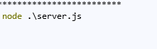
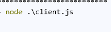
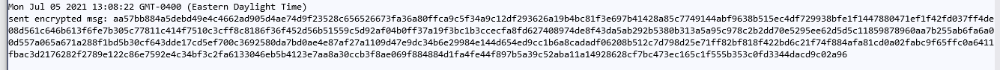
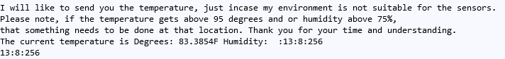
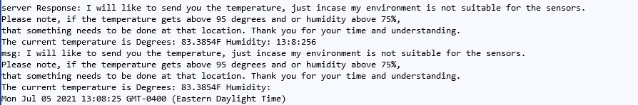
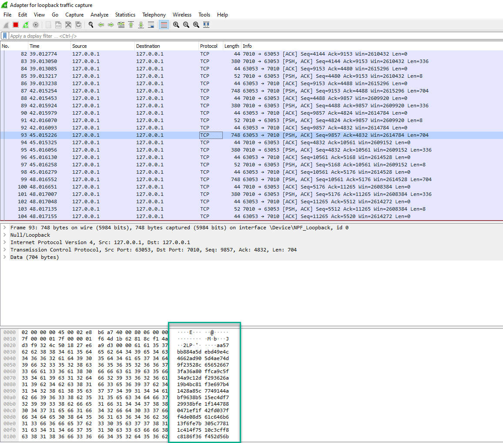
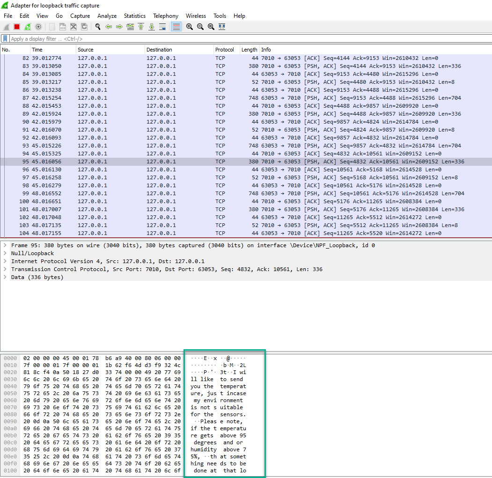

#### NodeJS--Server_Client_TCP-
The TCP server and client applications are written in Node.js.
The application is devised for the Client to send encrypted data under via a dedicated TCP Port to the server.
The data should be under 1000 bytes after it is encrypted.
The server in return will encrypt the message and send the plain text back to the client.
All communication will recieve a time stamp.
In this example i encrypt the message using apublic ECC certificate and the Symmetric algorithm I choose was AES256.
In order to start the application you must open a terminal and start the server. js first and then open a differnt terminal and start the client.js file.
Use the following commands
#### Node commands
-node server.js
- 

-node client.js

- 

The application is running and the client is sending messages to the server every 3 seconds.
- This picture showcase the client counsole sending teh encrypted data to the server.
-  

- This picture below showcase the server encrypting the message in it's console and sending the plaintext back to the client.
-  

This picture showcase the client recieving the server response with the plaintext message.
-  

#### WireShark

- For proof of concept I did a wireshark trace to see the messages running back and forth between the Client and the server.
- Since I just used the localhost for this example I had to trace the loopback Adapter.
- However, if you choose to use multiple clients with differnt IP Addresses you can map the trace via the TCP Port.
####Client sending encrypted message to server via wireshark
As you can see in the picture below, you notice the port number and the encrypte message.
Notice that the size of the file nearly doubles when you encrypt the message.
-  

####Server sending response to the client with plaintext via wireshark
Notice the file size is back to 380 and you can see the plaintext message in the trace.
-  

